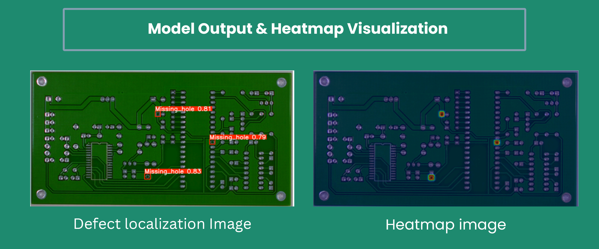
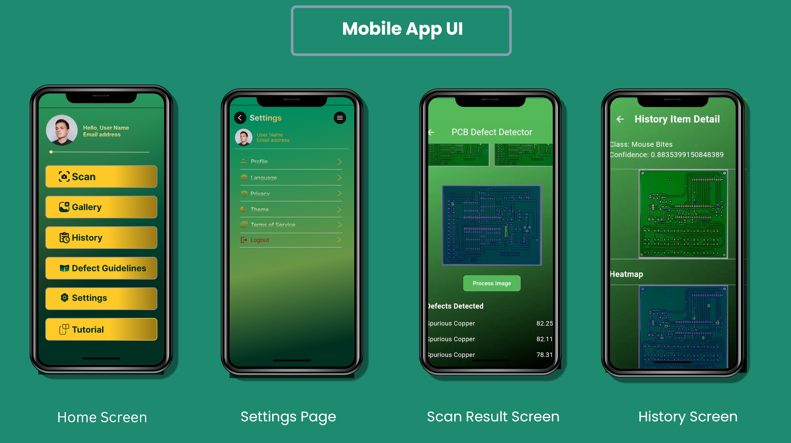
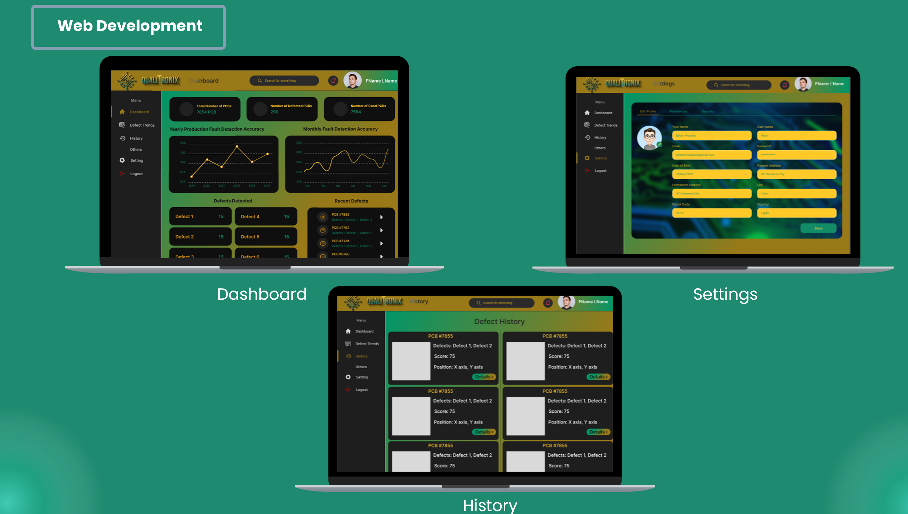

<div align="center">

# 🔬 Qualitronix

### Intelligent PCB Defect Detection & Analysis System

[](https://github.com/ultralytics/ultralytics)
[](https://flutter.dev)
[](https://fastapi.tiangolo.com)
[](https://aws.amazon.com)
[](LICENSE)

**School of Computer Science — CIC Cairo · Graduation Project GP2403 · 2024–2025**

[📄 Documentation](#-documentation) · [🚀 Getting Started](#-getting-started) · [📱 Mobile App](#-mobile-app) · [🌐 Web Platform](#-web-platform) · [📊 Results](#-results) · [👥 Team](#-team)

</div>

---

## 📌 Overview

**Qualitronix** is an AI-powered system for automated **Printed Circuit Board (PCB) defect detection**, built to address Egypt's Vision 2030 goals for industrial innovation and digital transformation.

PCBs are prone to manufacturing defects — short circuits, missing holes, spurs, open circuits, mouse bites, and excess copper traces — that compromise product reliability and increase production costs. Traditional inspection methods (manual or AOI) are slow, expensive, and error-prone.

Qualitronix solves this with:

- 🧠 An **enhanced YOLOv8 model** augmented with **Coordinate Attention (CoordAtt)** and **BiFPN** for state-of-the-art defect detection accuracy
- 📱 A **Flutter mobile app** for real-time on-site inspection with Eigen-CAM heatmap visualization
- 🌐 A **web platform** for batch analysis, defect dashboards, and production monitoring
- ☁️ A **cloud-native backend** on AWS EC2, FastAPI, MongoDB Atlas, and Cloudinary

---

## 📊 Results

Our enhanced YOLOv8 + CoordAtt + BiFPN model was evaluated on three public benchmark datasets:

| Dataset | mAP50 | mAP50:95 |
|---|---|---|
| **TDD-NET** | **99.1%** | **67.5%** |
| **Deep-PCB** | **93.4%** | **65.9%** |
| **PKU-Market-PCB** | **85.7%** | **50.6%** |

> Our model consistently outperforms the baseline YOLOv8m on all benchmarks. See [Chapter 5 of the documentation](docs/) for full confusion matrices, ROC curves, and comparison tables.

### Detected Defect Classes

`Missing Hole` · `Short Circuit` · `Spur` · `Open Circuit` · `Mouse Bite` · `Spurious Copper`

### 🖼️ Model Output & Heatmap Visualization



> **Left:** YOLOv8 defect localization with bounding boxes and confidence scores. **Right:** Eigen-CAM heatmap showing the model's attention regions.

---

## 🏗️ System Architecture

```
┌─────────────────────────────────────────────────────┐
│                  Qualitronix System                  │
│                                                     │
│  ┌──────────────┐          ┌──────────────────────┐ │
│  │  Flutter App │◄────────►│   FastAPI Backend    │ │
│  │  (Mobile)    │          │   (AWS EC2)          │ │
│  └──────────────┘          └──────────┬───────────┘ │
│                                       │             │
│  ┌──────────────┐          ┌──────────▼───────────┐ │
│  │  Web App     │◄────────►│  Enhanced YOLOv8     │ │
│  │  (Browser)   │          │  CoordAtt + BiFPN    │ │
│  └──────────────┘          └──────────┬───────────┘ │
│                                       │             │
│              ┌────────────────────────┼──────────┐  │
│              │                        │          │  │
│       ┌──────▼──────┐  ┌─────────────▼─┐  ┌────▼─┐ │
│       │ MongoDB Atlas│  │  Cloudinary   │  │  S3  │ │
│       └─────────────┘  └───────────────┘  └──────┘ │
└─────────────────────────────────────────────────────┘
```

---

## 🚀 Getting Started

### Prerequisites

- Python 3.9+
- Flutter SDK 3.x
- Node.js (for web frontend, if applicable)
- MongoDB Atlas account
- AWS EC2 instance (or local for development)

### 1. Clone the Repository

```bash
git clone https://github.com/ibrahimgerges1/Qualitronix.git
cd Qualitronix
```

### 2. Backend Setup (FastAPI)

```bash
cd backend
python -m venv venv
source venv/bin/activate  # Windows: venv\Scripts\activate
pip install -r requirements.txt
```

Create a `.env` file in the `backend/` directory:

```env
MONGODB_URI=your_mongodb_atlas_connection_string
CLOUDINARY_CLOUD_NAME=your_cloudinary_name
CLOUDINARY_API_KEY=your_cloudinary_api_key
CLOUDINARY_API_SECRET=your_cloudinary_api_secret
MODEL_PATH=path/to/your/best.pt
```

> ⚠️ **Never commit your `.env` file!** It's already in `.gitignore`.

Start the API server:

```bash
uvicorn main:app --reload --host 0.0.0.0 --port 8000
```

### 3. Download Model Weights

The trained model weights are too large for GitHub. Download them from:

📥 **[Model Weights — Google Drive / Hugging Face](YOUR_MODEL_LINK_HERE)**

Place the downloaded `best.pt` file in `backend/models/`.

### 4. Mobile App Setup (Flutter)

```bash
cd mobile
flutter pub get
```

Update `lib/config/api_config.dart` with your backend URL:

```dart
const String apiBaseUrl = 'http://YOUR_EC2_IP:8000';
```

Then run:

```bash
flutter run
```

---

## 📱 Mobile App

The Flutter mobile application provides real-time PCB inspection directly from a phone camera:

- 📸 **Capture** a PCB image using the device camera
- 🔍 **Detect** defects instantly via the YOLOv8 API
- 🌡️ **Visualize** defect locations using **Eigen-CAM heatmaps**
- 📋 **Review** detection history and export reports
- 🔔 **Alerts** for critical defect thresholds



### Tech Stack — Mobile

| Layer | Technology |
|---|---|
| Framework | Flutter + Dart |
| State Management | Provider / Riverpod / BLoC |
| Database | Firebase |
| Image Storage | Cloudinary |
| API | FastAPI (REST) |

---

## 🌐 Web Platform

The web platform is designed for production-floor analysts and quality managers:

- 📂 **Batch upload** multiple PCB images for analysis
- 📊 **Defect dashboard** with real-time production metrics
- 🗂️ **Historical reports** and defect trend tracking
- 👁️ **Eigen-CAM visualizations** for explainability
- 📤 **Export** reports in PDF/CSV



---

## 🧠 Model Architecture

Our enhanced model builds on YOLOv8m with two key improvements:

### Coordinate Attention (CoordAtt)
Replaces the standard attention with direction-aware channel attention, capturing long-range spatial dependencies along both axes — especially useful for detecting **small and thin defects** like spurs and mouse bites.

### BiFPN (Bi-directional Feature Pyramid Network)
Replaces YOLOv8's PANet neck with BiFPN for superior **multi-scale feature fusion**, enabling the model to detect defects across a wider range of sizes simultaneously.

---

## 📁 Repository Structure

```
Qualitronix/
├── backend/                  # FastAPI backend
│   ├── main.py
│   ├── requirements.txt
│   ├── models/               # ← Put best.pt here (not in Git)
│   ├── routers/
│   └── utils/
├── mobile/                   # Flutter app
│   ├── lib/
│   ├── pubspec.yaml
│   └── android/ ios/
├── web/                      # Web frontend
│   └── ...
├── model_training/           # YOLOv8 training scripts
│   ├── train.py
│   ├── model_architecture/   # CoordAtt + BiFPN implementation
│   └── evaluate.py
├── docs/
│   ├── screenshots/          # README images
│   │   ├── model_output.png
│   │   ├── mobile_app.png
│   │   └── web_platform.png
│   └── Qualitronix_Documentation.pdf
├── .gitignore
└── README.md
```

---

## 📄 Publications

This project resulted in two academic publications:

1. **Hassan, Y., Gerges, I., Ashraf, E., Alaaeldein, E., Abdallah, I., Ezzat, A., Mostafa, E., & Abdelghafar, S.** (2025, March). *A Mobile-Based Deep Learning Model for Printed Circuit Boards Defect Detection Using YOLO8 and Heatmap Visualization.* In Proceedings of the **2025 International Conference on Advanced Machine Learning Technologies and Applications (AMLTA'25)**. Cairo, Egypt.

2. **Hassan, Y., Ashraf, E., Gerges, I., & Abdelghafar, S.** (2025, June). *Enhanced YOLO with Coordinate Attention and BiFPN for Printed Circuit Board Defect Detection.* Submitted to the **International Journal of Information Technology, Springer**. Cairo, Egypt.

---

## 📄 Documentation

The full project documentation (121 pages) is available in the [`docs/`](docs/) folder, covering:

- Literature review & business case
- System architecture & design
- Model architecture & training methodology
- Experimental results & comparisons
- Deployment setup on AWS

---

## 👥 Team

| # | Name | ID | Major | Email |
|---|---|---|---|---|
| 1 | Youssef Hassan Ahmed | 202100152 | Data Science | youssef_h10152@cic-cairo.com |
| 2 | Ibrahim Gerges Mousa | 202100097 | Data Science | ibraim_g10097@cic-cairo.com |
| 3 | Eslam Ashraf Abdelaziz | 202300201 | Data Science | eslam_a00201@cic-cairo.com |
| 4 | Eslam Mostafa Abdelmoamen | 202300716 | Cloud Computing | eslam_m00716@cic-cairo.com |
| 5 | Essam Alaaeldein Alihamdy | 202100291 | Cloud Computing | essam_a10291@cic-cairo.com |
| 6 | Alia Ezzat Ali | 202100412 | Cloud Computing | alia_e10412@cic-cairo.com |
| 7 | Ibrahim Abdallah Ibrahim | 202100472 | Cloud Computing | ibrahim_a10475@cic-cairo.com |

**Supervised by:** Dr. Sara Abdelghafar, Assistant Professor of Computer Science — CIC Cairo

---

## 📦 Datasets

The following public datasets were used for training and evaluation. We do **not** include them in this repository — download them directly from the original sources:

- **[TDD-NET](YOUR_LINK)** — PCB defect detection dataset
- **[Deep-PCB](https://github.com/tangsanli5201/DeepPCB)** — Available on GitHub
- **[PKU-Market-PCB](YOUR_LINK)** — PCB defect dataset

---

## 📜 License

This project is released under the [MIT License](LICENSE).

---

## 🙋 My Contribution — Ibrahim Gerges

As one of the core researchers and AI engineers on this project, my responsibilities covered the full model development lifecycle and academic writing:

### 🧠 AI Model Development
- **Designed and implemented** the enhanced YOLOv8 architecture from scratch, integrating **Coordinate Attention (CoordAtt)** and **BiFPN** modules using **PyTorch**
- **Conducted all training experiments** across three benchmark datasets (TDD-NET, Deep-PCB, PKU-Market-PCB) using **Google Colab** and a **local GPU** setup
- **Evaluated model performance** including mAP50/mAP50:95 metrics, confusion matrices, ROC curves, and comparison against baseline YOLOv8m
- Iterated on hyperparameter tuning and architecture modifications to achieve **99.1% mAP50** on TDD-NET

### 📄 Research & Publications
- **Co-authored two academic papers** submitted to AMLTA'25 (conference) and Springer IJIT (journal)
- **Wrote 30–40% of both papers**, focusing on the methodology, model architecture, and experimental results sections
- Prepared all **results tables, figures, and analysis** for the experiments chapter
- Authored the papers using **LaTeX on Overleaf**
  

<div align="center">
  <sub>Built with ❤️ at CIC Cairo · School of Computer Science · 2024–2025</sub>
</div>


